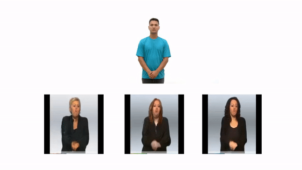
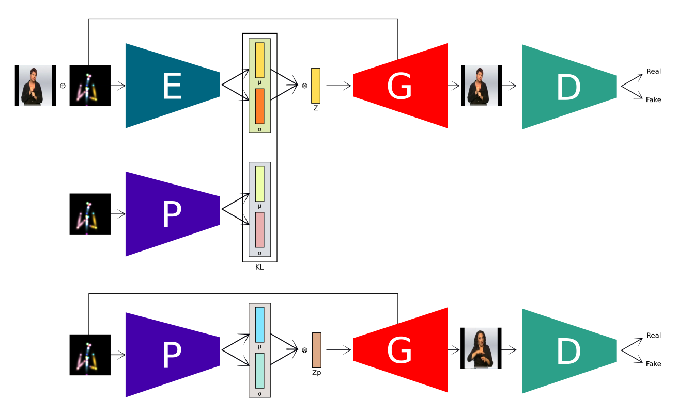

# SynLibras V2

The [SynLibras](http://sibgrapi.sid.inpe.br/col/sid.inpe.br/sibgrapi/2022/09.28.01.48/doc/thisInformationItemHomePage.html) is a Disentangled Deep Generative Model for Brazilian Sign Language Synthesis by
Wellington Silveira, Andrew Allaniz, Marina Hurtado, Bernardo Castello and 
Rodrigo de Bem, from the Center of Computational Sciences (C3), at the Federal University of Rio Grande (FURG). The work was presented in the SIBGRAPI 2022, Natal/RN, Brazil.

To cite the paper use the BibTeX entry below:
```
@inproceedings{silveira2022synlibras,
  title={SynLibras: A Disentangled Deep Generative Model for Brazilian Sign Language Synthesis},
  author={Silveira, Wellington and Alaniz, Andrew and Hurtado, Marina and da Silva, Bernardo Castello and de Bem, Rodrigo},
  booktitle={2022 35th SIBGRAPI Conference on Graphics, Patterns and Images (SIBGRAPI)},
  volume={1},
  pages={210--215},
  year={2022},
}
```

The first version of the published code can be found [here](https://github.com/ReplicAI/SynLibras_V1)



## Overview



Our SynLibras architecture is an CVAE-GAN model. During training, an RGB input image x is received by the Encoder (E) and reconstructed by the Decoder/Generator (G) aiming for the minimization of the L1-norm reconstruction loss. Meanwhile, the heatmap pose representation y is conditioning these two modules. It is also the input of a Prior (P), which is used in the minimization of the KL-divergence. Finally, a Discriminator module (D) classifies the output images as real or fake.

## Installation / Requirements

- PyTorch 1.12 on Python 3.7
- Install dependencies with `pip install matplotlib numpy Pillow tensorboard scikit-image torch torchvision`

## Dataset

The model was trained using the PHOENIX-2014 database which can be found here:

[RWTH-PHOENIX-Weather 2014](https://www-i6.informatik.rwth-aachen.de/~koller/RWTH-PHOENIX/)

The images used for training and testing can be found in the directory `phoenix2014-release/phoenix-2014-multisigner/features/fullFrame-210x260px`. For both training and testing, every 30th image was included. In addition, the images were resized to 260x260 pixels before being used by the human pose estimator [OpenPose](https://github.com/CMU-Perceptual-Computing-Lab/openpose).

Also, the [SynLibras-Pose dataset](https://github.com/ReplicAI/SynLibras-Pose-dataset), the first Libras dataset with keypoints annotations of the body, hands, and
faces of the signers was used for testing.

## Testing

We provide the pretrained model here:

[pretrained model (~860MB)](https://drive.google.com/file/d/1i5nQyz8tjFv1JZ2P4NQOoiwnFutbyirl/view?usp=sharing)

To run simple reconstruction, the images (ex: 0.png, 1.png, ...) must be placed in a folder called `frames` and the keypoints (ex: 0_keypoints.json, 1_keypoints.json, ...) must be placed in a folder called `keypoints`. Both folders must be in the same directory, like: `/dataroot/frames` and `/dataroot/keypoints`. This `dataroot` directory should be used as a parameter for the program.

```bash
python test.py \
phoenix256_vvix_0 \
[path_to_checkpoint] \
[path_to_data] \
--out_dir [path_to_results]
```

## Training

### Training Scripts

Use the following commands to launch training.

```bash
python train.py \
phoenix256_vvix_0 \
[path_to_checkpoint] \
[path_to_data] \
[path_to_validation_data] \
--batch_size 6
```

### Continuing training.

The training continues by default from the last checkpoint. To start from scratch, remove the checkpoint or change the network name.

## Acknowledgment

Some parts of the code were inspired by or copied from the [Swapping Autoencoder for Deep Image Manipulation](https://github.com/taesungp/swapping-autoencoder-pytorch) implementation. 

This work is supported by FAPERGS grant ARD-21/2551-0000678-1.
